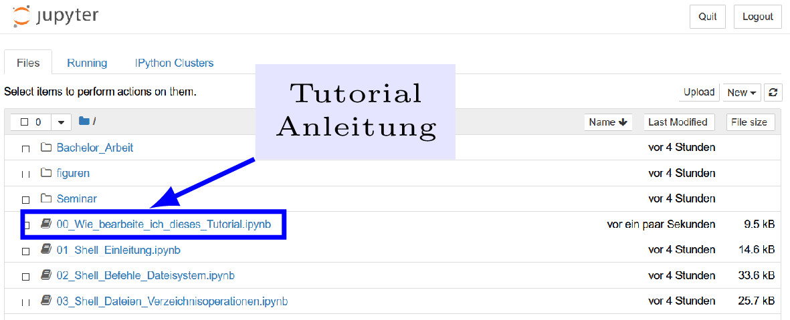

# Linux_Tutorial_Deutsch

**Bitte lesen Sie dieses README einmal komplett, bevor Sie mit den Materialien arbeiten**.

## Worum geht es?
Dies ist ein Online-Begleitkurs zu meinem Buch [Einführung in Unix/Linux für
Naturwissenschaftler](http://www.springer.com/de/book/9783662503003).

Der Kurs kann komplett online durchgeführt werden und beinhaltet das
Grundwissen für die Bedienung eines *Linux*-Systems im
naturwissenschaftlichem Kontext. Das Hauptaugenmerk des Kurses ist die
Nutzung der Unix-Kommandozeile sowie die Automatisierung von Prozessen
(z.B. die Analyse vieler Datensätze) und die Reproduzierbarkeit
wissenschaftlicher Ergebnisse.

Für einen tiefergehenden und umfassenderen Einstieg in Linux und
Übungsaufgaben mit Lösungen greifen Sie bitte auf das Buch oder andere
Materialien zurück.
 
## Wie starte ich den Kurs?
Der folgende Button führt Sie direkt zum Tutorial .

Klicken Sie nach dem Start bitte auf den Link
**00_Wie_bearbeite_ich_dieses_Tutorial.ipynb**. Dies gibt Ihnen
weitere Informationen, wie Sie den Kurs bearbeiten können; siehe auch folgende Figur:

# Direkte Links zu den einzelnen Lektionen
Alternativ können Sie einen der folgenden Links nutzen, um direkt zu einer
der acht Lektionen zu kommen:

1. [Lektion 00: Wie nutze ich das Tutorial?](https://binderhub.astro.uni-bonn.de/v2/gh/terben/Linux_Tutorial_Deutsch/master?urlpath=tree/00_Wie_bearbeite_ich_dieses_Tutorial.ipynb)

2. [Lektion 01: Was ist die Unix-Shell und warum soll ich mich damit beschäftgen?](https://binderhub.astro.uni-bonn.de/v2/gh/terben/Linux_Tutorial_Deutsch/master?urlpath=tree/01_Shell_Einleitung.ipynb)

3. [Lektion 02: Unix-Befehle und der Aufbau des Unix-Dateisystems](https://binderhub.astro.uni-bonn.de/v2/gh/terben/Linux_Tutorial_Deutsch/master?urlpath=tree/02_Shell_Befehle_Dateisystem.ipynb)

4. [Lektion 03: Datei- und Verzeichnisoperationen unter Unix](https://binderhub.astro.uni-bonn.de/v2/gh/terben/Linux_Tutorial_Deutsch/master?urlpath=tree/03_Shell_Dateien_Verzeichnisoperationen.ipynb)

5. [Lektion 04: Pipelines und Filter: Wie kann ich Unix-Programme für komplexere Aufgaben kombinieren?](https://binderhub.astro.uni-bonn.de/v2/gh/terben/Linux_Tutorial_Deutsch/master?urlpath=tree/04_Shell_Pipelines_und_Filter.ipynb)

6. [Lektion 05: Schleifen: Wie kann ich dieselben Operationen auf viele verschiedene Dateien anwenden?](https://binderhub.astro.uni-bonn.de/v2/gh/terben/Linux_Tutorial_Deutsch/master?urlpath=tree/05_Shell_for_Schleife.ipynb)

7. [Lektion 06: Shell-Skripte: Wie kann ich mir Kommandos merken und später wieder ausführen?](https://binderhub.astro.uni-bonn.de/v2/gh/terben/Linux_Tutorial_Deutsch/master?urlpath=tree/06_Shell_Shell-Skripte.ipynb)

8. [Lektion 07: Wie kann ich Inhalte in Dateien finden und in Unix-Programmen verwenden?](https://binderhub.astro.uni-bonn.de/v2/gh/terben/Linux_Tutorial_Deutsch/master?urlpath=tree/07_Shell_Dateiinhalte_finden_und_nutzen.ipynb)
